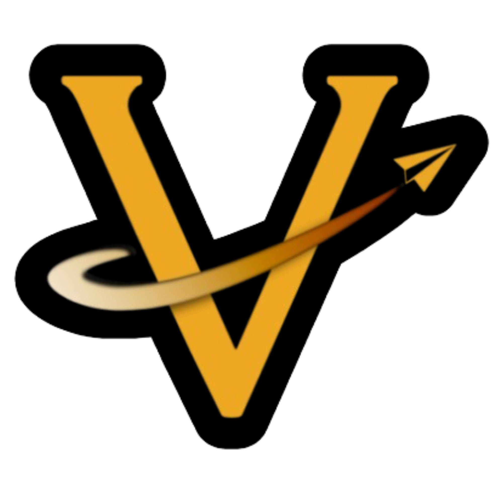
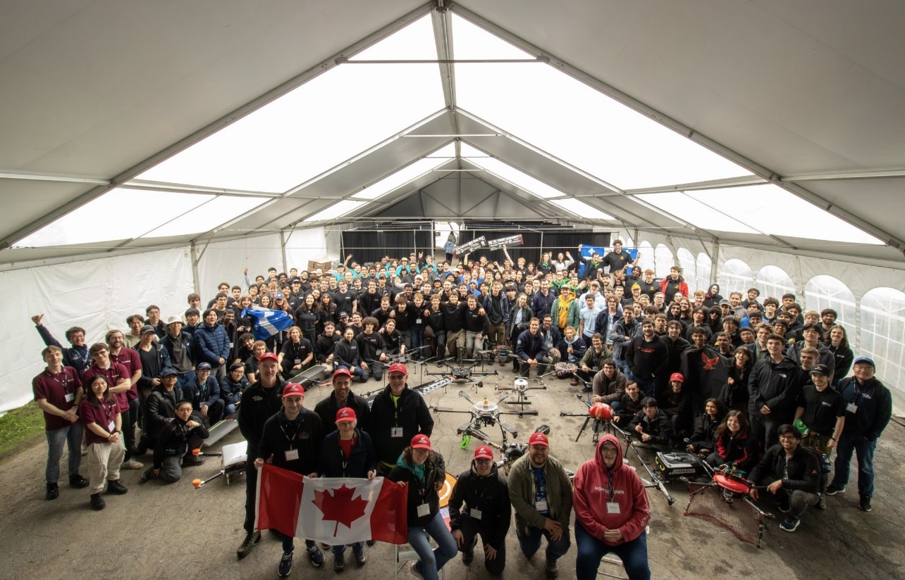
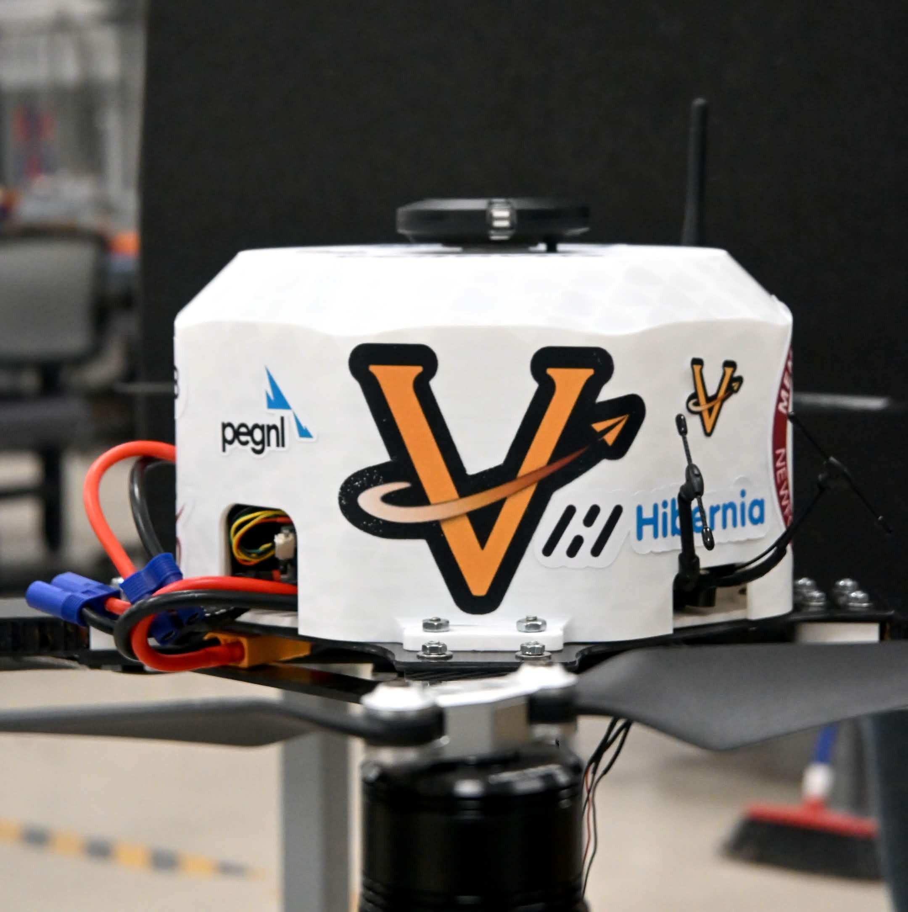
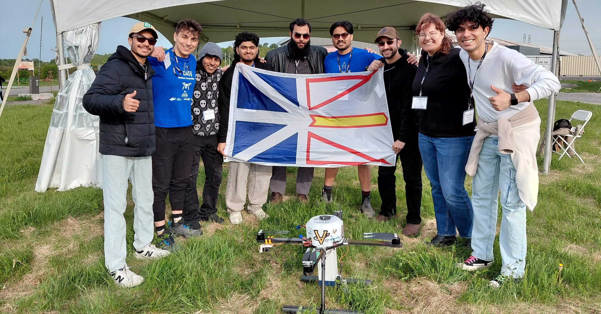

  

# Valiant Aerotech

Student UAS team building autonomous systems for the [AEAC National Student UAS Competition](https://www.aerialevolution.ca/annual-student-competition/).

  

## What we do

- Design and build custom multirotor platforms for competition tasks
- Autonomous flight software (perception, navigation, mission control)
- Embedded systems and hardware integration
- Ground control tooling, testing, and field iteration

## Fleet

| Platform | Role |
|----------|------|
| **Vion** | Fire suppression (GCS-offload autonomy) |
| **Vivi** | Building survey and target localization |
| **Vulcan 2** | Heavy lifter / Vivi transport |

  

<em>Vion - Task 2 fire suppression platform</em>

## Teams

  

- **Software** - Autonomy, CV, GCS missions, and integration for detection, delivery, and suppression
- **Electrical** - Power, propulsion, sensors, and safety systems for reliable field operation
- **Mechanical** - Airframes, payload integration, and structures for urban firefighting scenarios

## Contribute

- Follow team communication channels for assignments and field tests
- All code changes via **pull requests** (no direct pushes to `main`)

## Contact

- Email: `admin@valiantaerotech.com`
- Instagram: [@valiantaerotech](https://www.instagram.com/valiantaerotech)
